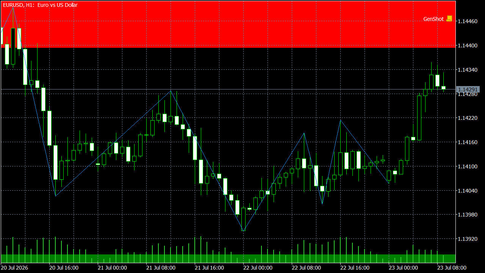

# Ruptura & Bloco

Porte C++/MQL5 de um indicador técnico de price action / estrutura de mercado (market structure), para uso no MetaTrader 5.

**🇧🇷 Português** · [🇺🇸 English](#english)

## O que é

Este projeto é um porte do indicador Pine Script "Market Structure Break & Order Block", de autoria de EmreKb, publicado originalmente na TradingView. A lógica foi reimplementada do zero em C++ (motor de cálculo, compilado como DLL) e em MQL5 (indicador nativo para o MetaTrader 5), sem depender do runtime Pine.

O cálculo parte de um ZigZag com comprimento configurável (`zigzag_len`) para identificar topos e fundos alternados do preço. A partir dessas pernas, o indicador detecta uma Market Structure Break (MSB):

- **MSB bearish**: o preço rompe um topo anterior e, em seguida, forma fundos mais baixos.
- **MSB bullish**: o preço rompe um fundo anterior e, em seguida, forma topos mais altos.

A confirmação do rompimento usa um fator de Fibonacci (`fib_factor`): a nova máxima (ou mínima) só é considerada breakout válido se ultrapassar o nível `1 + fib_factor` (ou o equivalente do lado da mínima) calculado sobre a perna anterior do ZigZag.

Após identificar a MSB, o indicador plota o Order Block (OB) correspondente como uma box no gráfico:

- Em MSB bearish, o OB é o último candle de alta antes da máxima que originou o rompimento.
- Em MSB bullish, o OB é o último candle de baixa antes da mínima que originou o rompimento.

Boxes antigas ou já rompidas podem ser removidas automaticamente (`delete_boxes`), há inputs separados de cor/borda/texto para OB de alta e de baixa, e a exibição das linhas do ZigZag pode ser ligada ou desligada.

## Instalação — versão pré-compilada

1. Copie `msb_orderblock.dll` para a pasta `MQL5/Libraries` do seu terminal MetaTrader 5.
2. Copie `TV_13_MSB_OrderBlock.ex5` para a pasta `MQL5/Indicators` do mesmo terminal.
3. Reinicie o MetaTrader 5 (ou clique com o botão direito em "Indicadores" no Navegador e escolha "Atualizar").
4. Arraste o indicador `TV_13_MSB_OrderBlock` do Navegador para o gráfico desejado.

## Build a partir do código-fonte

1. Compile o motor C++ (`msb_orderblock`) com g++/MinGW-w64, usando o `build.sh` incluso em `src/cpp/` — isso gera o `.dll`.
2. Abra `src/mql5/TV_13_MSB_OrderBlock.mq5` no MetaEditor do MetaTrader 5.
3. Compile com F7 para gerar o `.ex5`.

## Licença

Este repositório é licenciado sob MPL-2.0. A lógica original em Pine Script é de autoria de EmreKb.

## Aviso

Uso educacional e de análise técnica. Não constitui recomendação de investimento.

---

## English

C++/MQL5 port of a price action / market structure technical indicator for MetaTrader 5.

### What it is

This project is a port of the Pine Script indicator "Market Structure Break & Order Block", authored by EmreKb, originally published on TradingView. The logic was reimplemented from scratch in C++ (calculation engine, compiled as a DLL) and MQL5 (native MetaTrader 5 indicator), with no dependency on the Pine runtime.

The calculation starts from a ZigZag with a configurable length (`zigzag_len`) to identify alternating price highs and lows. From these legs, the indicator detects a Market Structure Break (MSB):

- **Bearish MSB**: price breaks a prior high and then forms lower lows.
- **Bullish MSB**: price breaks a prior low and then forms higher highs.

Breakout confirmation uses a Fibonacci factor (`fib_factor`): a new high (or low) is only considered a valid breakout if it moves past the `1 + fib_factor` level (or the equivalent on the low side) computed over the ZigZag's prior leg.

After identifying the MSB, the indicator plots the corresponding Order Block (OB) as a box on the chart:

- On a bearish MSB, the OB is the last bullish candle before the high that triggered the breakout.
- On a bullish MSB, the OB is the last bearish candle before the low that triggered the breakout.

Old or already-broken boxes can be removed automatically (`delete_boxes`), there are separate color/border/text inputs for bullish and bearish OBs, and the ZigZag line display can be toggled on or off.

### Installation — precompiled version

1. Copy `msb_orderblock.dll` into your MetaTrader 5 terminal's `MQL5/Libraries` folder.
2. Copy `TV_13_MSB_OrderBlock.ex5` into the same terminal's `MQL5/Indicators` folder.
3. Restart MetaTrader 5 (or right-click "Indicators" in the Navigator and choose "Refresh").
4. Drag the `TV_13_MSB_OrderBlock` indicator from the Navigator onto the chart.

### Build from source

1. Compile the C++ engine (`msb_orderblock`) with g++/MinGW-w64, using the `build.sh` script included in `src/cpp/` — this produces the `.dll`.
2. Open `src/mql5/TV_13_MSB_OrderBlock.mq5` in MetaTrader 5's MetaEditor.
3. Compile with F7 to produce the `.ex5`.

### License

This repository is licensed under MPL-2.0. The original Pine Script logic was authored by EmreKb.

### Disclaimer

Educational and technical-analysis use only. Not investment advice.
